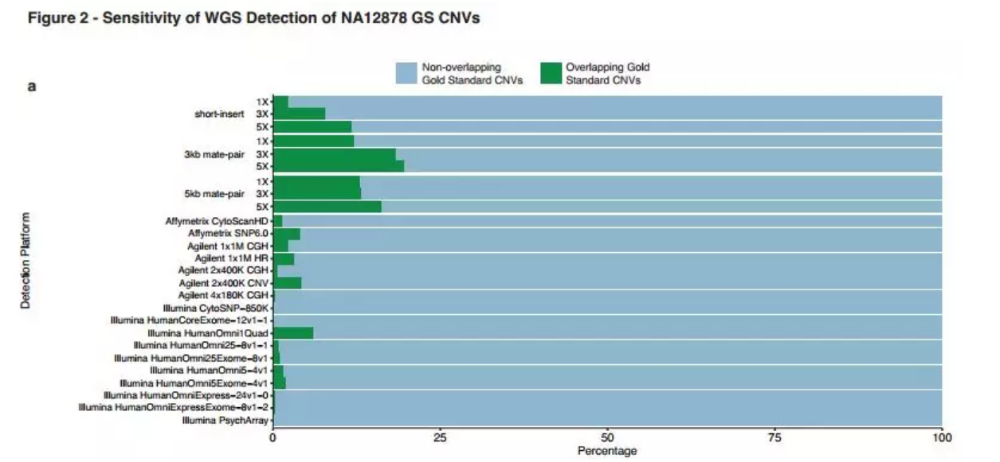

# CNVseq方法介绍

## 1.WGS

### 1.0 问题：
    1）mask重复区
    2）GC异常区校正
    3）mappingability校正
    4）PCR偏好性：可用PCR free建库代替

### 1.1 低深度WGS：5x以下，分辨率低，对于大的CNV敏感度高，但成本低、样本周转周期短、对计算机硬性条件低
    分辨率在几十kb以上，因为了保证每个窗口有足够的reads，一般设置窗口大小为20kb，这样分辨率为60kb，对于小的CNV检测不到。

### 1.2 高深度WGS：5x以上，如30X或50X,分辨率高，敏感度高，问题是成本高、样本周转周期长（测序、分析等）、对计算机硬性条件和分析人员要求高。
    [CNVseq算法]()

### 1.3 Array VS low WGS vs high WGS（比较low WGS是否能代替Array）
    参考链接：https://mp.weixin.qq.com/s?__biz=MzA4MDQ0NzM1MQ==&mid=2650190427&idx=1&sn=2e6ba5f4bbce220fbcbdedd782c05f69&chksm=87a60043b0d1895511b18bebd8927db0990b055a49c4c5f7bb3d00f460642ee690bfbf8fa0d5&mpshare=1&scene=1&srcid=0618CdFLteORM9Uq0fm9KD6U&from=singlemessage&clicktime=1563013462&ascene=7&devicetype=android-24&version=27000536&nettype=WIFI&abtest_cookie=BgABAAgACgALABIAEwAVAAYAnYYeACOXHgBWmR4AzpkeAPaZHgAMmh4AAAA%3D&lang=zh_CN&pass_ticket=Qqq9pMkDQZov5Lp7nyDrhZrjSqrruJ2qB1B43ThVXkvNTKO%2Bz8DsZZsZ%2BuHs9om%2B&wx_header=1
    参考文献：Whole-genome sequencing analysis of genomic copy number variation (CNV) using low-coverage and paired-end strategies is highly efficient and outperforms array-based CNV analysis

    1)low WGS vs Array: 
    对多种不同检测CNV的低深度WGS方法进行综合分析，同时研究了350 bp 短插入文库构建法WGS（short-insert）,3kb配对文库构建法WGS（3kb-insert mate-pair）, 及5kb配对文库构建法WGS（ 5kb-insert mate-pair）分别在1X, 3X, 及 5X测序深度时检测CNV的有效性。以NA12878样本中经验证的CNV作为分析的金标准（Gold Standard ，GS)，用以确定这些CNV是否能在每种低深度WGS方法中检测到。为比较金标准确定的CNV（GS-CNV），我们采取了Haraksingh et al 23在研究高密度寡聚物阵列（high-density oligomer arrays）时的标准方法,此后我们将低测序深度的WGS与之前arrays的研究结果进行比较
    *CNV分析方法：
     一、read depth：此种方法通过CNVnator (version 0.2.7)来实现，算法过程中大小为5000bp的二进制文件用于生成柱状图及统计分析等，产出的CNV数据将与从UCSC下载的人类参考基因组hg19进行比对，接着会滤过大于300kb且与基因间隙区重叠超过50%的数据及X染色体上的主要组织相容性复合物区。二、disconcordant read pairs：此种方法通过 LUMPY (version 0.6.11)来实现。从UCSC Genome Browser下载的segmentation duplication和reference gaps从分析的基因组区域去掉，仅筛选出缺失及重复CNV用于后续分析。大于150kb的CNV也被滤除。
    *CNV分析标准：
    合并read depth和discordant read pair法检出的CNV。如果两种方法检测出来的CNV有至少50%的重叠区，则由discordant read pairs法检测出的数据代替。与Haraksingh 等描述的方法一致，合并后的CNV将与由NA12878基因组数据设定的金标准CNV进行比较，结果共分两类：（1）有大于或等于50%的相应重叠区；（2）有大于或等于10%却小于50%的相应重叠区。合并后的CNV依照银标准也可划分为两组：（1）有大于50%的相应重叠区；（2）有小于50%的相应重叠区。不同方法检出的CNV的敏感性通过计算得出：即检测到的与金标准CNV大于50%重叠的个数除以先前已鉴定的所有金标准的CNV个数。
    *Array数据的分析：
    所有样本的array测序数据获得后，仅信号>10的连续探针及最大Log BAF > 10 的CNV数据被用于分析。
    
    *总结：
    1)low WGS比array敏感度高，在权衡短插入文库构建与长插入文库构建的利弊后(短插入文库构建法测序及数据分析约2.5~3天，配对文库构法WGS则大致需要4~5天。配对文库构建法测序时使用的DNA量大约是array的两倍多，由于配对文库构建法WGS要优于array，故只要DNA的量足够即可倾向于选择WGS。对于DNA量有限的样本，3X短插入文库构建法WGS仍是值得考虑的选择，因为其检出CNV的效率要优于array。)，控制每份样本的花费及测序周转时间后，low WGS性价比更高。
    
   
     
    2)同时需关注的是，高通量测序中仍有>80%的GS-CNV未被检测到。分析检测到的CNV大小发现，配对文库构建法更易检出5kb~10kb大小的CNVs(检出率>50%，Figure 2b-d)。
    3)虽然CNV的检出率随着测序深度的增加而增加，但此种增加并未呈现线性关系。增加率最快的是短插入文库构建法及3kb文库构建法的1X及3X WGS（Figure1）。与短插入文库构建法WGS相比，配对文库构建法WGS能检出更多的CNV，尤其是在3X的配对文库构建法的WGS中，更多的CNV及GS-CNV被检测出来（Figure 2a, Figure 1b）。此外，随着测序深度的增加，更多的GS-CNV也被检测出来。当CNV的大小在50kb左右的时候，增加测序深度对GS-CNV的检出率影响不大（Figure 2b-d）。在短插入文库构建法WGS中，随着测序深度的增加，5kb-50kb的GS-CNV检出率有最明显的增加，而配对文库构建法WGS随着测序深度的增加CNV的检出率变化不大。不管是哪种文库构建法，其检出50kb-500kb的大片段GS-CNV随着测序深度的增加都无明显变化（Figure2b-d）
    4)检出CNV的大小分布:短插入文库构建法及配对文库构建法检出的CNVs的大小分别在100bp~500kb及1kb~500kb之间（Figure 3），深度测序法及不一致配对分析法检出的CNVs的大小也不相同（Figure 3d-I）。整体而言，WGS检出的CNV长度范围比array更广泛；所有深度分析法检出的CNV都大于5kb（Figure 3d-f），而不一致序列分析法检出的CNV的大小的变异性则较大（Figure 3g-i）。同时，随着测序深度的增加，不管对于哪种CNV检出方法，检出的CNV的数量的增加主要体现在小于50kb的CNV上。
    
## 2.WES

### 2.1 问题 
    1）捕获偏好性（覆盖度不均一）
    2）模板不连续
    3）

### 2.2 解决方法

## 3.Panel

### 3.1 问题

### 3.2 解决方法
