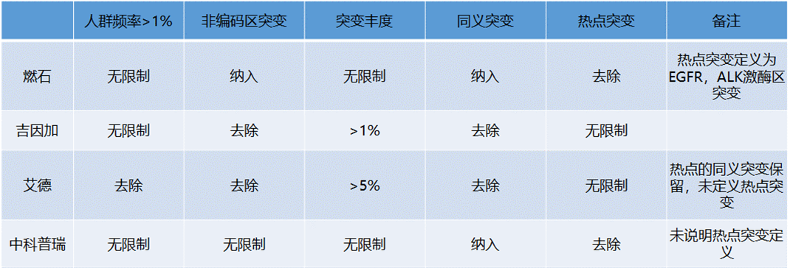

# NGS临床检测的流程

## 1.[数据拆分](https://www.jianshu.com/p/0eaa6bce82b2)

### 1.1 文库结构

    
    说明如下：
    1)P5和P7是接头序列
    2）I1和I2是index序列，长度都为7nt，用于区分同一条lane的不同子文库。
    3）B1和B2是Barcode序列，又称UMI，长度为8nt，用来区分同一子文库中不同的样本。
    4）R1和R2包括barcode序列信息，bcl2fastq按照I1和I2拆分得到子文库，split_fastq按照B1和B2拆分得到样本fastq，此时fastq包含Barcode序列，利用fastp将Barcode序列从R1和R2中移除，并放到read ID上。如下图：

    
    
### 1.2 fastq数据的一级拆分
     BCL转换成fastq后进行，基于index将fastq数据进行一级拆分，得到子文库类型的fastq文件，该子文库包含多个样本的fastq数据，这么做的原因是为了保证GC平衡，另一份方面也是为了保证一条lane能上足够多的样本。具体原理如下：
    根据每条lane所有子文库index序列的比对结果来确定拆分是否容错：当同lane index间最小差异碱基数大于等于3时，允许1个碱基错配，其余情况不容错
    
### 1.3 fastq数据的二级拆分（针对子文库的fastq数据）
    根据barcode信息将子文库fastq数据被拆分成单个样本的fastq数据，该阶段不容错，拆分后barcode序列还是保留着。

### 1.4 fastp切除barcode
    fastp去掉低质量reads和接头，然后将barcode序列从read序列上切除，放在read ID上，如UMI_ATGCTAGG_GTCAGTAA

## 2.bwa比对、排序和合并
    1）Bwa mem比对，过滤低质量比对reads(-q 10), 过滤未比对reads（-F 4）。
    2）Samtools merge对比对结果进行合并。

## 3.去重和校正（consensus bam）
   一种barcode包括15种UMI(长度为8bp），双端UMI一共为15*15=225组合，利用[gencore](https://github.com/OpenGene/gencore)进行去重和校正：
   1）去重：比对位置起始、终止位置都相同，UMI相同的reads为duplication
   2）校正：利用高深度测序中的duplication对PCR和测序错误进行校正，具体算法参考gencore。
   3）对于肿瘤样本，使用gencore按照同barcode，同起始，同终止的原则对*.sort.bam进行去重与碱基校正。默认血浆使用>=2x raw reads支持，alt_ratio>=0.8；组织使用>=1x raw reads支持，alt_ratio >=0.9。对于白细胞对照样本，使用sambamba进行去重。
   
   gencore的算法：
   1）clusters the reads by their mapping positions and UMIs (if UMIs are applicable).
   2）for each cluster, compares its supporting reads number (the number of reads/pairs for this DNA fragment) with the threshold specified by supporting_reads. If it passes, start to generate a consensus read for it.
   3）if the reads are paired, finds the overlapped region of each pair, and scores the bases in the overlapped regions according their concordance and base quality.
   4）for each base position at this cluster, computes the total scores of each different nucleotide (A/T/C/G/N).
   5）if there exists a major nucleotide with good quality, use this nucleotide for this position; otherwise, check the reference nucleotide from reference genome (if reference is specified).
   6）when checking the reference, if there exists one or more reads are concordant with reference genome with high quality, or all reads at this positions are with low quality, use the reference nucleotide for this position.

  
## 4.变异检测
    1）samtools mpileup（-B -q 20 -Q 0）分别建立肿瘤及白细胞样本pileup文件。
    2）MutLoci检出原始突变。白细胞保留所有突变用作对照，肿瘤样本保留初筛阈值线以上突变（vaf >=0.001/0.01, alt>=2, uniq_depth >=100 ）
    3）链特异性过滤（fisher‘s exact p value<0.001,倍数>=10）。
    4）对于normal中存在alt支持的突变，要求alt<=10, tumor_vaf >= 10 * normal_vaf。
    5）位点合并，annovar注释，transvar校正，过滤人群频率>=0.05的点。
    6）alt碱基位置与一致性过滤，热点与非热点检出。对于候选alt位点，过滤碱基位置位于比对首尾及PE reads不一致的reads, 热点tumor_vaf>=0.001/0.01, alt>=3; 对于非热点tumor_vaf>=0.005/0.03, alt>=3。
    7）检出结果一般只保留热点及非同义突变位点。

## 5.阴性背景池构建
    过滤背景信号，457血浆阴性背景池包含27个正常人的血浆样本，457组织阴性背景池包含70个正常人的组织样本，31血浆阴性背景池包含24个正常人的血浆样本，31组织阴性背景池包含30个正常人的组织样本，构建方法如下：
### 5.1 得到consensus bam
    同上方式
### 5.2 检测单个样本的背景突变
    samtools mpileup -f hg19.fasta -l LC_CRC_456.cnv.bed -d 100000  -B -q 20 -Q 0 -a YF1918P.cons.bam | python getBackgroundMutation.v2.1.py YF1918P.bgm.cons.xls

### 5.3 合并多个样本的背景突变
    python combineMutation.py conf.xls cons.total.bgm.xls
    
    conf.xls格式为：样本名 样本名..bgm.cons.xls。如下：
        YF1918P YF1918P.bgm.cons.xls

### 5.3 背景模型拟合
    利用[fitdistrplus](https://www.cnblogs.com/ywliao/p/6297162.html)包判断背景突变的vaf符合哪种统计学模型，然后通过qqplot判断实际数据与该统计学模型数据的相关性大小和pvalue值。([判断数据是否服从某一分布（一）](https://www.cnblogs.com/ywliao/p/6265945.html))
    perl FitBGMModel.pl -i cons.total.bgm.xls -o cons.total.bgm.xls.fit

### 5.4 利用背景突变过滤掉背景噪音
     perl filterBGM.pl -i annovar.combined.xls.strand -n info.txt -o annovar.combined.xls.test -bp sort.total.bgm.xls.fit -bt sort.total.bgm.xls.fit
     当只有阴性背景池中一个样本有突变，采用的二项分布检验；当只有阴性背景池中2-4个样本有突变同时不符合weibull分布时，采用的z检测；其他情况为weibull分布。
     附：
     1）正态分布为数学家高斯在研究误差理论时创建的，又称高斯分布。如果连续型随机变量X满足概率密度函数：f(x)，则称X服从均值为μ，方差为σ^2的正态分布N（μ，σ^2）.
     2）方差越小，正态分布越窄，否则越胖。
     3）通过计算正态分布密度曲线下的面积可以得到随机变量X的概率，如F(xi)=P(X<xi)，其中μ±1.96σ^2的面积为95%，其中μ±2.58σ^2的面积为99%。
     4）正态分布的位置和形状随均值和方差变化，为了应用方便，通过u变换（或称z变换）令u=（X-μ）/σ，将正态分布X~N（μ，σ^2)转换为u~N(0,1)的标准正态分布，即u分布或Z分布。若样本含量为n的样本均数Xj服从总体均数为μ、总体标准差为σXj的正态分布N（μ，σXj^2)，则通过同样方式的u变换（（Xj-μ）/σXj）也可以将其转换为标准正态分布N(0,1),即u分布。但实际过程中σXj常常未知，即用SXj代替，则（Xj-μ）/SXj不再服从标准正态分布，而服从t分布: t=Xj-μ/SXj=Xj-μ/S*n^1/2  (自由度v=n-1)。t分布开创了小样本统计推断的新纪元，主要用于总体均数的区间估计和t检验。
     5）正态分布抽样产生的样本均值服从正态分布，对于当样本量大于60时非正态分布抽样产生样本均值符合近似服从正态分布。利用抽样的样本均值和标准差去估计总体的均值和标准差。
     6）z检验或u检验：对于符合标准正态分布的随机变量X，利用P(X>u(α))<=尾端5%面积来判断X是否为小概率事件。

## 6.变异过滤

### 6.1 链偏好性过滤[getStrandInfo.py]
    过滤条件：1）plus_alt = 0 或者 minus_alt = 0
             2）plus_alf_vaf = plus_alt/(plus_ref+plus_alt),minus_alf_vaf = minus_alt/(minus_ref+minus_alt),plus_alt_vaf/minus_alt_vaf>10或者1/10.

### 6.2 

## 7.化疗位点检测
### 7.1 从phmGKB数据库获得化疗位点数据库
    共有31条药物+位点信息，包括位置，基因型，药物等信息，如下：
    药物	基因/位点	作用	结果解读	等级	默认分型	chrom	pos	ref	alt	genotype
    甲氨蝶呤Methotrexate 	ABCB1/rs1045642	毒副作用	AA:Patients with the AA genotype and lymphoma or leukemia who are treated with methotrexate may have increased concentrations of the drug and may have an increased risk of toxicity as compared to patients with the GG genotype, although this is contradicted in some studies. Other genetic and clinical factors may also influence a patient's risk of methotrexate-induced toxicities. 	2A	AA	7	87138645	A	G	0/0
    甲氨蝶呤Methotrexate 	ABCB1/rs1045642	毒副作用	AG:Patients with the AG genotype and lymphoma or leukemia who are treated with methotrexate may have an increased risk of toxicity as compared to patients with the GG genotype, or a decreased risk of toxicity as compared to patients with the AA genotype, although this is contradicted in some studies. Other genetic and clinical factors may also influence a patient's risk of methotrexate-induced toxicities.	2A	AA	7	87138645	A	G	0/1
    甲氨蝶呤Methotrexate 	ABCB1/rs1045642	毒副作用	GG:Patients with the GG genotype and lymphoma or leukemia who are treated with methotrexate may have lower concentrations of the drug and may have a reduced, but not absent, risk of toxicity as compared to patients with the AA genotype, although this is contradicted in some studies. Other genetic and clinical factors may also influence a patient's risk of methotrexate-induced toxicities. 	2A	AA	7	87138645	A	G	1/1

### 7.2 从sample.raw.snpindel.xls文件中找到相应化疗位点位置的vaf值，如果vaf小于0.2，则认为该样本该化疗位点的基因型为0/0(这种判断是不合适的，应该要求alt reads>=20)。如果0.2<=vaf<=0.7,则认为该样本该化疗位点的基因型为0/1。如果vaf>0.7,则认为该样本该化疗位点的基因型为1/1。

## panel设计
    优化panel设计算法，提高各种突变类型的检测性能
        Indel 区（关联cosmic数据库,掺入突变型探针）
        Fusion区（增加探针密度，并找到最佳间隔距离）
        低GC区（增加探针数量，并找到增加最佳值）
        重复区（mismatch对捕获效率的影响，去除重复区的原则 ） 

# 问题集合

## 1.位点合并
    1）位点是否在同一条reads， 不在一条reads上，不能合并，可通过samtools tview查看
    2）/share/work3/capsmart/pipeline/capSMART/CAPcSMART/capSMART/combinePosInVcf.pl

## 2.低频嵌合位点

###2.1 嵌合现象（mosaicism）
   1）嵌合现象：表示一个个体中有2或2种以上基因型的现象。嵌合现象包括体细胞嵌合（发生在体细胞种）和性腺嵌合（发生在性腺种），性腺嵌合是体细胞嵌合的一种特殊形式，嵌合现象发生在性腺中。体细胞嵌合会影响个体本身，而性腺嵌合会影响后代([Mosaicism is] erupting all the time in the process of the development of the organism, he said—potentially contributing to disease in adults, as well as potential risks to their childre)。广义的嵌合现象包括分化后的体细胞突变、多能干细胞突变和胚胎阶段的全能干细胞的突变（每个位点代际突变概率为10^-8，人体的细胞数量为10^14，每个个体突变细胞数量为10^6个，说明嵌合现象在人体中非常普遍，不过有些是有害的），而狭义的嵌合现象指的是胚胎阶段全能干细胞发生突变如有丝分裂错误，复制错误以及SNV/INDEL、结构变异等。
   2）如果鉴定胚系突变为denovo mutation，应该排除该突变是否为嵌合突变（可以用血液样本PCR进行鉴定，但是如果白细胞中没有嵌合，该方法无效。那么应该利用cfDNA的方式进行鉴定），因为嵌合突变会影响后代。

  3)WES检测嵌合突变方法：先证者和父母都存在的非同义突变，但是该突变在父母中低于0.5，而在先证者中趋向于0.5，再利用用二项分布检验判断先证者中为P<0.05或在父母中P>10^-5则表示为嵌合突变(查看文献确定)，然后一代验证。
   由于遗传的嵌合突变像新发突变一样，不必经过纯化选择，所以当确定用于严重早发性疾病的患者时，它们是特别有意义的。我们的结果表明，在临床确定致病变异的时候，除了注重分析新发突变，也要考虑父母嵌合突变。
  看了本文有点惊讶父亲携带25%突变可以完全没有表型，这也提示我们在数据分析时，很可能认为这是遗传自父母的变异而把它排除，在日常分析时，还应该对先证者单独分析，然后再看父母的数据，而不能一上来trio就只看新发突变、隐性纯合与复合杂合突变以及X染色体连锁隐性位点。另外看了文章的分析方法是用GATK，GATK分析胚系突变还行，但分析低比例嵌合突变差强人意，这也可以从表1中突变丰度都在10%以上可以看出，也许用肿瘤分析体细胞突变的算法可以发现更多的父母低比例嵌合遗传事件。（https://mp.weixin.qq.com/s/o6rLK1qm8AjPRNsdHfIZSQ)
  
https://bbs.genelinks.com/thread-916-1-1.html?from=groupmessage&isappinstalled=0
https://www.ncbi.nlm.nih.gov/pmc/articles/PMC3615857/
https://www.researchgate.net/post/What_does_Mosaic_Mutation_really_mean
https://www.spectrumnews.org/news/large-study-shines-spotlight-mosaic-mutations-autism/
https://www.the-scientist.com/daily-news/mosaic-mutations-may-not-be-rare-35342

## 3.CNV不报缺失，是因为只有2个拷贝，检测不太准确，很可能是样本原因造成的，如捕获等。而且CNV缺失也没有相应的靶向药。但是抑癌基因（tp53，）的CNV缺失还是有意义的。

## 4.
   1)除了贝瑞基因、安诺优达贴牌测序仪外，吉因加、泛生子以及更多公司将贴牌补充上游生产战略供应，而Axbio(安序源)、齐碳科技等至少5家企业快速开发新一代国产测序仪。PCR方面，包括达微生物、臻准生物、永诺生物、新弈生物、锐迅生物、领航基因等均加入代理或自主生产的竞争中。 
   2)关于这点，对照其他上市公司和准上市公司，高附加值业务是知易行难的战略要点。初步来看，除了试剂盒拿证进入医院及LDT两条腿同步走，和上游战略合作、贴牌或自主研发成为主要方式之一

## 5.hotspots long indel vaf from 0.01(0.001) to 0.005(0.0005) mutation, somatic_snv_indel

## 6.热点是不过滤对照白细胞样本的，但是需要过阴性背景池

## 7.化疗位点原理

## 8.基金和股权

## 9.异体输血：第一次大概是输血后30天送样，有污染，第二次,40天，无污染

## 10.各种异常的情况：如高TMB的样本，主转录本上为同义突变，splicing区变异与indel

## 11.突变位点保留原则：
    1）主转录本；2）同义或者错义；3）非主转录本选择在功能区
    CD22的主转录本为NM_001771，由于在主转录本上为同义突变，因此流程选择第一个转录本结果
    ERBB2的主转录本为NM_004448，transvar没有注释到主转录本上，流程选择NM_001289936上的splicing突变
    GNAS的主转录本为NM_000516，transvar没有注释到主转录本上，流程选择NM_080425上的cds区域的注释结果

## 12.IVD创新产品申报类别集中在PCR类和测序类，这类产品注册价格高、注册周期长是普遍性的特点，所以LDT（临床实验室自建项目）一定是未来的趋势之一。

## 13.在pileup格式中(没有-u或者-g参数)，每一行代表基因组的位置，由染色体名、1个碱基坐标、参考碱基、reads覆盖该位点的数量、reads的碱基、碱基质量和比对质量。有关匹配、错配、插入缺失、链、比对质量和一条reads的开始结束位置都被编码到reads碱基列。在此列上，“.”表示与正链上的参考碱基匹配，“,”表示与负链上的参考碱基匹配，“>”和“<”表示跳过参考基因，“ACGTN”表示正链上的错配，“acgtn”表示负链上的错配。此模式“+[0-9]+[ACGTNacgtn]+”表示在此位点至下一个位点之间与参考基因组对应位点相比，多了一段插入碱基，插入长度由模式中的整数表示。与此类似，“-[0-9]+[ACGTNacgtn]+”表示缺失，缺失的碱基使用“*”表示。同时，“^”表示reads的开始，“$”表示reads的结束。在“^”后的字符的ASCII码值减去33表示比对质量值。

## 14.Unique Molecular Identifier（UMI），4 - 8bp，每个beads上理论存在4^8 (65,536)个UMI，用来区分transcripts，理论上可以区分6W个转录本吗？？分子条形码又称分子标签（MolecularBarcode, 有时也称UID Unique identifiers, UMI Unique molecular identifiers）是对原始样本基因组打断后的每一个片段都加上一段特有的标签序列，用于区分同一样本中成千上万的不同的片段，在后续的数据分析中可以通过这些标签序列来排除由于 DNA 聚合酶和扩增以及测序过程中所引入的错误。分子条形码通常由大约 10nt 左右的随机序列（比如 NNNNNNN)，或者简并碱基（NNNRNYN）组成。有别于样品标签（sample index 或 sample barcode），分子条形码是针对同一个样本中的不同片段加上的标签序列，而样品标签是用于区分不同样本而加上的标签序列。因此，每一个样本只能有一个相同的样品标签，但可以有成千上万的分子条形码。分子条形码作用的原理如图 1，同一个样本的 DNA 片段，每一个片段都带有一个特有的标签序列，它会随目标序列一起经过文库构建、PCR 扩增，然后被一同测序。最终测序得到的序列中，带有不同标签的序列，代表它们来自不同的原始 DNA 片段分子；带有相同分子标签的序列，代表这些序列都是从同一条原始的 DNA 片段扩增而来的。由于 PCR 和测序过程中的错误是随机发生的，因此根据这些分子标签，可以在去除冗余的过程中将PCR和测序等过程中带来的系统突变排除掉。 Peng et al. [1] 比较了利用分子条形码和不用分子条形码进行数据分析的结果，他们发现通过利用分子条形码这种方法，可以大大降低低频突变的假阳性率。

## 15.单个位点的最低uniq深度为150

## 16.性能验证结果文件组织问题

## 17.LOD问题

## 18.收集电话

## 19.克隆性造血
由于大部分血浆循环游离DNA提取于外周血细胞，非恶性造血细胞，比如克隆性造血的体细胞突变可能引起血浆循环游离DNA基因检测假阳性。克隆性造血突变为外周血白细胞携带的体细胞突变，来源于造血干细胞突变，由于造血干细胞克隆产生大量的白细胞导致cfDNA检测过程中产生假阳性突变

## 20.收集客户反馈的有问题的案例

## 21.了解常见癌基因的所有信息（突变，融合，CNV，结构变异，用药）

## 22.室间质评评估流程（包括报出范围的审查）

## 23.T790M每次都检查？

## 24.不同的点LOD设置不一样

## 25.ddPCR/RMS/MLPA/

## 26.组内管理：
   1）规矩：邮件礼仪；执行领导安排，有意见就说；反馈问题给领导；完不成事情提前说；事情需要指定负责人，问清楚。
   2) 人员招聘事宜
   3）组内规划：本周完成
   4）特殊结果收集
   5）组内人员工作评估标准：好或坏
   6）明确每个人的工作职责
   7）流程完全转产后才能转到商业生产，好像办不到
   

## 27.生信参考品收集

## 28.每次产品报出多个各基因的fusion或CNV

## 29.融合和CNV检测探针设计原理

## 30.拆不出数据的提前监控，目前夏浩那边管理拆分流程太忙了

## 31.每个产品有SNV/FUSION/CNV QC bed文件，他们的区别和作用

## 32.有意思的漫画

## 33.根据LOH校正CNV检测结果

## 34.各领域大牛（早筛：张鹍等；陆舜）

## 35.胎儿性别鉴定和亲子鉴定

## 36.各个产品出报告前的特殊操作：如胚系0.05<vaf<0.3的P,LP和VUS点，如果之前没有验证过，则需要进行一代验证，如果三次验证结果都为为假，则为假阳性位点

## 37.扩增子测序（RNAfusion），如何目标序列很少，如何建库？是加了control amplicons

## 38.位点合并：
   1）位点自动合并(combinePosInVcf.pl)
   
   2）需审核后合并的位点(warningPosInResult3.pl)
   a.利用warningPosInResult3.pl)计算annovar.combined.xls（先按照样本名，再按照染色体，再按照起始基因组坐标排序）中染色体坐标靠后位点（如a2=start2)和靠前位点（a1=start1+ref-1)的差值a2-a1。如果a2-a1>=6或a2-a1<0,则该靠后位点和靠前位点不能合并在一起。
   b.具体位点合并原则有：是否在同一条read上(顺式或者反式)，顺式可合并，反式不可以，如果顺式和反式都有，则两种都存在；突变频率是否接近，如果接近，则可合；
   c.复杂的位点合并可用samtools tview或IGV查看

## 39.IGV查看位点：
   1)SNP/INDEL
   2)CNV
   3)FUSION：
   a.点击选择bam文件，然后右键选择Expanded和color mismatch base，color alignments by选择no color, group alignments by选择none
   b.工具栏选择Regions,然后选择genelists,创建新的融合基因对，每行代表一个基因坐标：如下
     chr4:25666625-25666625
     chr6:117658309-117658309
   c.reads数如何与结果中保持一致呢？

## 40.融合解读规则阅读及融合探针

## 41.DCE2.0数据库规则

## 42.遗传解读规则

## 43.TMB研究

43.1 市场部调研1：
1）关于WES的TMB算法竞品调研上，从可获得的资料来看，大部分采用的都是评估非同义突变方法，其中臻和额外扣除了热点突变；
2）从循证医学角度来看，目前基于WES法评估免疫治疗疗效的临床研究采用的是评估错义突变分析方法；

43.2 市场部调研2：吉因加、燃石、艾德均没有WES的产品，根据查文献，调研到的信息如下：
 
1）关于WES单独计算TMB，调研到的公司及临床研究信息WES计算TMB均没有考虑到同义突变，只计算了CDS区非同义突变或错义突变总数，具体见附件TMB文献，是一篇2019年ESMO关于TMB的综述及上封邮件；
2）2019年FDA批准了NantHealth公司Omics Core平台的510(K)，首个获批基于WES进行TMB计算的平台，也是基于全外显子中体细胞非同义突变的总数，详情可见链接http://www.seqchina.cn/10921.html
3）关于大panel与WES检测TMB一致性研究，调研到两篇文献，WES与大panel是统一的算法，求平均数的时候考虑了同义突变，
用到的panel为foundationone的315genes ，详情见附件TMB一致性研究的2篇文献
 
因此鉴于同时有大Panel和WES检测产品的公司较少，建议参考文献中的算法，即
1）算总数时，非同义突变或错义突变总数
2）算平均数时，按与大panel一致的计算方法

43.3 以下是我们得知的几家公司的大panel TMB算法

   
   

## 参考链接
[gencore](https://github.com/OpenGene/gencore)
[fitdistrplus](https://www.cnblogs.com/ywliao/p/6297162.html)
[weibull distribution](http://reliawiki.org/index.php/The_Weibull_Distribution)
